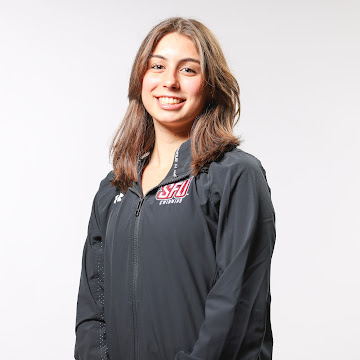

# Sara Blanco Gómez

**Phone:** (469) 514-1171  
**Email:** svb6726@psu.edu  
**Address:** 532 E College Ave., State College, PA 16801  

---

## `Education`

**Pennsylvania State University, State College, PA**  
*Expected 2030*

- PhD Candidate in Chemistry under Dr. Carly Schissel

**Saint Francis University (SFU), Loretto, PA**  
*May 2025*

- Bachelor of Science in Biochemistry and Chemistry (ACS Certification) — GPA: 3.95/4.00  
- Minor in Biology and Mathematics  

---

## Qualifications

### Laboratory Skills
Cyclic Voltammetry; Spectroscopy (UV-Vis, ¹H NMR, FTIR, Flame AA, GFAAS); Chromatography (Ion-exchange, Affinity, GC, HPLC); Streaking; Western Blot; Gel Electrophoresis; SDS-PAGE; Dialysis; Protein Assaying; Ultra- and Microcentrifugation  

### Computer Skills
Microsoft Word, Excel, PowerPoint; MATLAB (function analysis); Python (basic programming and probability functions)

### Languages
- Spanish (Fluent)  
- English (Fluent)  

---

## Research Experience

### Research Associate  
**Saint Francis University, Loretto, PA**  
*January 2024 – Present*

- Studying the effectiveness of glutathione as a cataract formation inhibitor against UV radiation in bovine lenses  
- Awarded an Office of Student Research grant to fund research expenses  

### Research Assistant — Dr. Michele Hargittai  
*May 2023 – June 2023*

- Studied *Typha latifolia* phytoremediation by analyzing heavy metal effects on HSP70 expression  
- Collected samples and performed SDS-PAGE, Western blot, and flame AA spectroscopy  
- Presented poster at the SFU Undergraduate Research Symposium  

### Research Assistant — Dr. Rose Clark  
*May 2022 – June 2023*

- Analyzed cytochrome c electron transfer using electrochemical cells and cyclic voltammetry  
- Synthesized and manipulated peptides to create self-assembled monolayers on gold electrodes  
- Presented poster at the SFU Undergraduate Research Symposium  

---

## Work Experience

### Laboratory Assistant Intern  
**Atlántica Agrícola, Villena, Spain**  
*May 2024 – August 2024*

- Optimized growth media for micro- and macroalgae and evaluated incorporation into bio-stimulants and fertilizers  
- Assisted with calibrations, product and raw material stability testing, microbial compatibility testing, and sterilization procedures  

### Game Assistant  
*May 2022 – May 2025*

- Supported softball, football, and soccer games as ball-picker, parking assistant, and ticket vendor  

### Academic Tutor  
*September 2022 – May 2025*

- Tutor for General Chemistry I & II, Calculus I & II, Beginning and Intermediate Spanish  

---

## Leadership & Involvement

### Saint Francis University Division I Swimming Team  
*August 2021 – May 2025*

- Participate in ten practices per week and ~11 meets per season, including Conference Championships  
- Promote resilience and team motivation following competitive setbacks  

### Student-Athlete Mentor  
*August 2023 – May 2025*

- Provide weekly mentorship to first-year student-athletes  
- Assist in organizing community engagement events  
- Promoted to leadership position in Fall 2024  

### Chemistry Club  
Active Member | August 2021 – May 2025  

---

## Honors & Awards

- Chemistry First-Year Student Award (2022)  
- Fr. Albert Driesch / Avian Technologies Award for Excellence in Organic Chemistry (2023)  
- President’s List — Fall 2021, Spring 2022, Fall 2022, Spring 2024  
- Dean’s List — Spring 2023, Fall 2023  
- Gamma Sigma Epsilon Chemistry Honor Society (2023)  
- Kappa Mu Epsilon Mathematics Honor Society (2023)  
- Chemistry Senior Award (2025)

---

## Volunteer Service

### Special Olympics — Swimming Officer Volunteer  
**Saint Francis University**  
*April 2022, 2023, 2024*

- Assisted in organizing and managing swimming events  
- Provided one-on-one athlete support in an inclusive environment  

### Food Pantry Worker  
**Dorothy Day Outreach Center, Loretto, PA**  
*Fall 2021*

- Distributed food and essential items to underserved populations  
- Assisted with pantry organization and maintenance  
